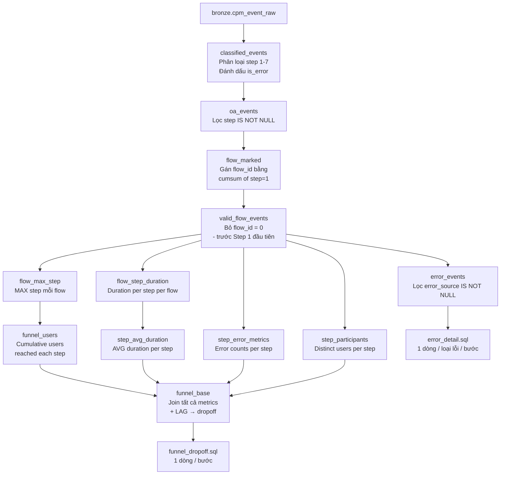

# Data Flow — Luồng Mở Tài Khoản (OA Funnel)

**Task:** Phân tích funnel mở tài khoản 7 bước — drop-off, thời gian, lỗi  
**Platform:** Trino (Trino_superset)  
**Nguồn:** `bronze.cpm_event_raw`  
**Generated:** 2026-04-08

---

## Sơ đồ luồng xử lý

---

## Mô tả từng CTE

| # | CTE | Mục đích | Ghi chú nghiệp vụ |
|---|-----|----------|--------------------|
| 1 | `classified_events` | Map `key` → `step` (1–7), tính `is_error` | Filter `acountid IS NOT NULL` + date range |
| 2 | `oa_events` | Chỉ giữ event thuộc OA flow | Bỏ event không thuộc 7 bước |
| 3 | `flow_marked` | Đánh số luồng OA bằng cumulative sum | Mỗi Step 1 = luồng mới trong cùng session |
| 4 | `valid_flow_events` | Bỏ event trước Step 1 đầu tiên | `flow_id > 0` |
| 5 | `flow_max_step` | Max step từng luồng đạt được | Dùng cho funnel cumulative |
| 6 | `flow_step_duration` | Thời gian (ms) = MAX - MIN event_ts per step per flow | Đơn vị: milliseconds |
| 7 | `step_avg_duration` | AVG duration per step trên tất cả flows | Chuyển sang giây (`/ 1000`) |
| 8 | `funnel_users` | Số KH distinct đến ít nhất Step N | CROSS JOIN với 7 step values |
| 9 | `step_error_metrics` | total errors, users with error, distinct error types | Tính trên event level |
| 10 | `step_participants` | Distinct users có event trong bước | Mẫu tính error_rate_pct |
| 11 | `step_names` | Inline lookup tên bước | UNION ALL 7 dòng |
| 12 | `funnel_base` | Join metrics + LAG để tính dropoff | Window function trên 7 dòng |

---

## Output columns

### `funnel_dropoff.sql`

| Cột | Ý nghĩa |
|-----|---------|
| `step` | Số bước (1–7) |
| `step_name` | Tên bước tiếng Việt |
| `users_reached` | Số KH distinct đạt ít nhất bước này (cumulative) |
| `users_prev_step` | Số KH bước trước |
| `dropoff_count` | Số KH rời bỏ tại bước này |
| `dropoff_rate_pct` | % rời bỏ so với bước trước |
| `conversion_from_step1_pct` | % còn lại so với Step 1 |
| `total_error_events` | Tổng event lỗi trong bước |
| `users_with_error` | Số KH gặp lỗi trong bước |
| `distinct_error_types` | Số loại event lỗi khác nhau |
| `error_rate_pct` | % KH gặp lỗi / KH tham gia bước |
| `avg_duration_sec` | Thời gian TB thực hiện bước (giây) |
| `avg_duration_min` | Thời gian TB thực hiện bước (phút) |

### `error_detail.sql`

| Cột | Ý nghĩa |
|-----|---------|
| `step` | Số bước |
| `step_name` | Tên bước |
| `error_event` | Tên event lỗi (giá trị cột `key`) |
| `error_source` | Nguồn phát hiện: `event_key` / `segmentation` / `event_key + segmentation` |
| `occurrence` | Tổng số lần lỗi này xảy ra |
| `affected_users` | Số KH distinct bị lỗi này |
| `days_observed` | Số ngày khác nhau lỗi xuất hiện |
| `pct_of_step_errors` | % lỗi này chiếm trong tổng lỗi của bước |

---

## Lưu ý khi chạy

- **Filter date:** Bắt buộc có `data_date` range để tránh full scan bảng lớn. Cập nhật trong `classified_events`.
- **Filter app:** Thêm `AND app_key = '<hash>'` vào `classified_events` nếu muốn lọc theo app cụ thể (xem mapping tại `context/data-dictionary.md`).
- **acountid là string:** Không CAST sang số — giá trị dạng `H53165`.
- **timestamp là VARCHAR:** CAST sang BIGINT để sort. Giá trị Unix milliseconds.
- **Funnel cumulative:** Đếm distinct `acountid` gộp qua tất cả flows và sessions. Một KH mở tài khoản nhiều lần vẫn chỉ đếm 1 lần ở funnel.
